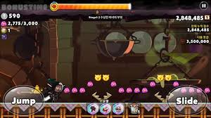
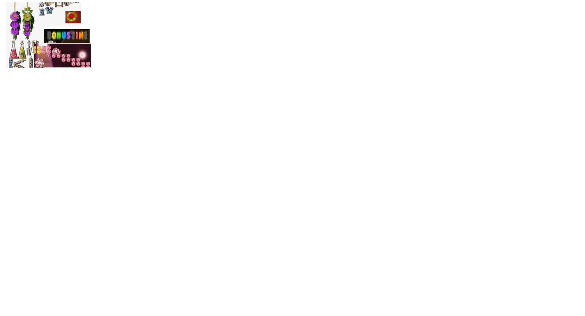

1. 게임의 소개

- 제목:쿠키런 

 런게임이며 안죽고 높은점수를 얻어서 골인지점 까지 가는게임입니다.
 높은점수를 얻으며 최대한 멀리까지 가는 것이 목적이며,
 캐릭종류마다 추가 스킬들이 있으며 그 스킬들과 아이탬들을 사용해 
 장애물들을 지워 최대한 멀리까지 가야합니다.

2. GameState (Scene) 의 수 및 각각의 이름

아마 통맵으로 하나 길게 만들고 보너스 스테이지라고 조건 성립하면 다른곳으로 잠시 이동하는식 으로 해보려고 합니다.

3. 각 GameState 별 다음 항목

- 화면에 표시할 객체들의 목록

특수아이탬,점수올려주는오브젝트,장애물들,이벤트맵가게하는 조건아이탬
- 처리할 키/마우스 등 이벤트
c나ALT로 점프 space로 슬라이딩 
- 다른 State 로 이동한다면, 각 이동에 대한 조건 및 방법
bonus time 이라는 8개 글자를 먹으면 이벤트맵으로 이동.
-- 다이어그램 형식으로 나타낼 수 있으면 더 좋음.

4. 필요한 기술
오브젝트컬링,카메라 플레이어 중심 따라가기.충돌처리

