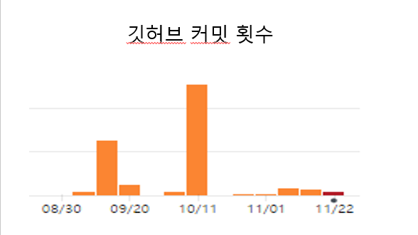
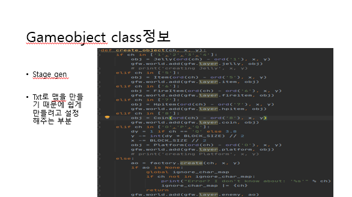

1. 게임의 소개

- 제목:쿠키런 

 런게임이며 안죽고 높은점수를 얻어서 골인지점 까지 가는게임입니다.
 높은점수를 얻으며 최대한 멀리까지 가는 것이 목적이며,
 캐릭종류마다 추가 스킬들이 있으며 그 스킬들과 아이탬들을 사용해 
 장애물들을 지워 최대한 멀리까지 가야합니다.

2.메인게임화면구성 
케릭터의 체력바가 위에 있고, 아래에 점수, 왼쪽중단에 먹은 코인개수가 있다.

3.개발 범위

4.10주차 계획

